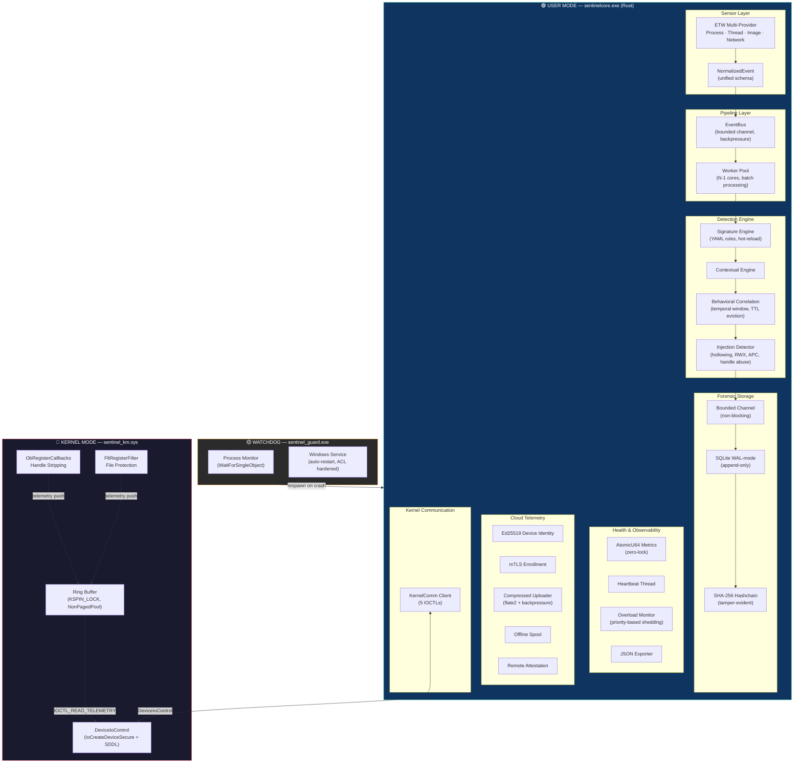
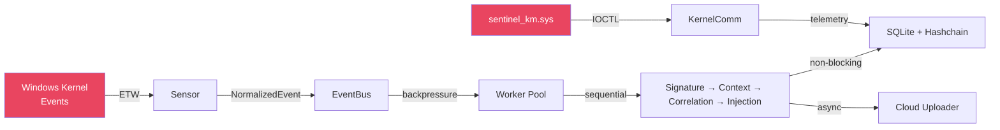
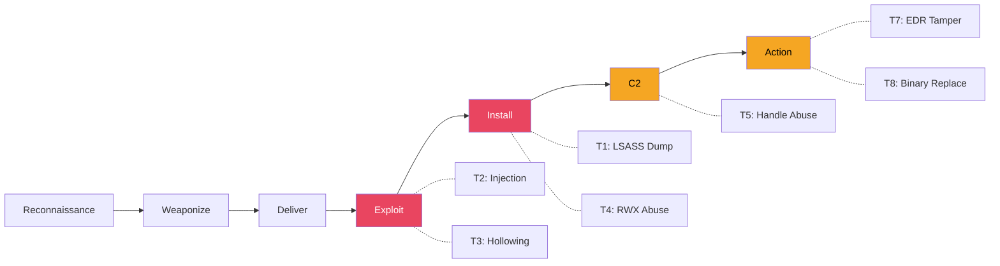

# SentinelCore — Enterprise Endpoint Detection & Response Agent

**Author:** Vo hoang  
**Stack:** Rust (user-mode) · C/WDK (kernel-mode) · ETW · SQLite · Ed25519 · mTLS  
**Lines of Code:** ~6,500 (Rust) + ~800 (C/WDK)  
**Target:** Windows 10/11 x64

---

## 1. Architecture Diagram



### Data Flow Summary



---

## 2. Threat Model

### 2.1 Threats Addressed

| #   | Threat                               | MITRE ATT&CK | Detection Method                                                                                           | Engine                                   |
| --- | ------------------------------------ | ------------ | ---------------------------------------------------------------------------------------------------------- | ---------------------------------------- |
| T1  | **Credential Dumping (LSASS)**       | T1003.001    | OpenProcess to lsass.exe with `PROCESS_VM_READ` → correlate with memory read pattern                       | `injection/handle_state.rs`              |
| T2  | **Classic Remote Thread Injection**  | T1055.003    | `OpenProcess → VirtualAllocEx → WriteProcessMemory → CreateRemoteThread` sequence within 5s window         | `injection/remote_thread_detector.rs`    |
| T3  | **Process Hollowing**                | T1055.012    | 4-stage state machine: `CreateProcess(SUSPENDED) → UnmapViewOfSection → WriteProcessMemory → ResumeThread` | `injection/hollowing_detector.rs`        |
| T4  | **RWX Memory Abuse**                 | T1055        | Allocation with `PAGE_EXECUTE_READWRITE` in foreign process, cross-referenced with write + thread creation | `injection/process_memory_state.rs`      |
| T5  | **Handle Abuse / Escalation**        | T1134        | Rolling window of OpenProcess calls; flag when a single PID opens >10 handles with dangerous rights in 30s | `injection/handle_state.rs`              |
| T6  | **APC Injection**                    | T1055.004    | `OpenThread → QueueUserAPC` correlated with prior `VirtualAllocEx`                                         | `injection/remote_thread_detector.rs`    |
| T7  | **EDR Tampering**                    | T1562.001    | taskkill/sc stop/ETW session kill → blocked by ObCallbacks + MiniFilter + service recovery                 | `sentinel_km.sys` + `sentinel_guard.exe` |
| T8  | **Binary Replacement**               | T1036.005    | SHA-256 self-integrity check on startup; MiniFilter blocks write/delete to agent binaries                  | `engine/integrity.rs` + `minifilter.c`   |
| T9  | **Privilege Escalation via Service** | T1543.003    | Behavioral correlation: new service creation → immediate child process with high-integrity token           | `correlation/rules.rs`                   |

### 2.2 Kill Chain Coverage



### 2.3 Design Intent

> "SentinelCore is built to detect **post-exploitation lateral movement** — the phase where attackers already have initial access and attempt to escalate privileges, dump credentials, inject into trusted processes, or neutralize security tooling. Every detection module targets a specific, documented MITRE ATT&CK technique with a concrete multi-event correlation pattern, not single-event heuristics."

---

## 3. Stability & Safety Considerations

### 3.1 Why Detection-Only in Kernel?

| Principle                                    | Rationale                                                                                                                                                                                               |
| -------------------------------------------- | ------------------------------------------------------------------------------------------------------------------------------------------------------------------------------------------------------- |
| **Kernel does NOT make detection decisions** | Detection logic is complex, evolving, and error-prone. A bug in detection logic inside the kernel = BSOD. User-mode can crash and restart; kernel cannot.                                               |
| **Kernel only enforces protection policy**   | ObCallbacks strip access rights (soft deny, not hard block). MiniFilter denies writes to specific known files. These are static, simple, testable rules.                                                |
| **Detection runs in user-mode Rust**         | Rust's memory safety eliminates entire classes of bugs (buffer overflow, use-after-free, data races). Pattern matching and temporal correlation can be debugged, logged, and updated without rebooting. |
| **Telemetry flows upward, never downward**   | Kernel pushes events to a ring buffer. User-mode polls. Kernel never executes logic based on user-mode input beyond PID registration.                                                                   |

### 3.2 Deadlock Avoidance

| Component              | Synchronization                    | Guarantee                                                                                                                                    |
| ---------------------- | ---------------------------------- | -------------------------------------------------------------------------------------------------------------------------------------------- |
| Ring Buffer            | `KSPIN_LOCK`                       | Never held across blocking calls. Acquire → insert/remove → release. Maximum hold time: ~1μs.                                                |
| Protected Process Lock | `EX_PUSH_LOCK` (shared/exclusive)  | ObCallback acquires **shared** (concurrent reads OK). IOCTL acquires **exclusive** only for PID set/clear (rare operation). No nested locks. |
| EventBus (Rust)        | `crossbeam::bounded` channel       | Bounded capacity (10K). Producer blocks on full = natural backpressure. No mutex.                                                            |
| SQLite Writer          | Dedicated thread + bounded channel | Worker threads never touch SQLite directly. Channel decouples pipeline from disk I/O entirely.                                               |
| Metrics                | `AtomicU64` / `AtomicUsize`        | Zero locks. Compare-and-swap only. No contention possible.                                                                                   |

**Lock ordering rule:** `ProtectedProcessLock` → `RingBuffer.Lock`. Never reversed. Never nested with any other lock.

### 3.3 Performance Guarantees

| Metric                       | Target                                     | Mechanism                                                                                |
| ---------------------------- | ------------------------------------------ | ---------------------------------------------------------------------------------------- |
| **ETW event latency**        | < 1ms from kernel event to NormalizedEvent | Direct callback → channel push, no intermediate copy                                     |
| **Worker throughput**        | > 100K events/sec sustained                | N-1 core worker pool, batch processing (64 events/batch)                                 |
| **Kernel callback overhead** | < 5μs per ObCallback invocation            | No allocation in fast path (protection not active). Single PEPROCESS pointer comparison. |
| **MiniFilter overhead**      | < 10μs per IRP_MJ_CREATE                   | Fast exit on non-dangerous access mask. Filename check only when write/delete detected.  |
| **Ring buffer push**         | O(1) amortized                             | Single allocation + list insert. Eviction only when full (4096 cap).                     |
| **Memory footprint**         | < 2MB kernel non-paged pool                | Ring buffer capped at 4096 × ~300 bytes = ~1.2MB max. No unbounded allocations.          |

### 3.4 IRQL Discipline

```
┌─────────────────────────────────────────────────┐
│ DISPATCH_LEVEL (2)                              │
│   ├─ KSPIN_LOCK (Ring Buffer)                   │
│   ├─ InterlockedIncrement (counters)            │
│   └─ ObCallback Pre-operation (runs at ≤ APC)   │
├─────────────────────────────────────────────────┤
│ APC_LEVEL (1)                                   │
│   ├─ EX_PUSH_LOCK (Protected Process)           │
│   └─ FltGetFileNameInformation (MiniFilter)     │
├─────────────────────────────────────────────────┤
│ PASSIVE_LEVEL (0)                               │
│   ├─ DriverEntry / DriverUnload                 │
│   ├─ IoCreateDeviceSecure                       │
│   ├─ ObRegisterCallbacks / FltRegisterFilter    │
│   ├─ PsLookupProcessByProcessId                 │
│   └─ RingBufferDestroy (cleanup)                │
└─────────────────────────────────────────────────┘
```

**Rules enforced:**

- No `ExAllocatePool` at DISPATCH_LEVEL with PagedPool.
- No `KeWaitForSingleObject` inside any callback.
- No ZwXxx calls inside ObCallbacks or MiniFilter pre-ops.
- `PAGED_CODE()` macro in all PASSIVE_LEVEL functions to catch violations in checked builds.

### 3.5 Why Not Hook / Why Not Block

| ❌ What we DON'T do                      | Why                                                                                   |
| ---------------------------------------- | ------------------------------------------------------------------------------------- |
| SSDT hooking                             | Triggers PatchGuard → BSOD. Unsigned modification of kernel code tables.              |
| Inline patching (ntoskrnl/ntdll)         | Breaks Windows updates. AV false positives. Violates WHQL.                            |
| DKOM (Direct Kernel Object Manipulation) | Hides driver from PsLoadedModuleList = rootkit behavior. Detectable by Defender.      |
| Hard-blocking OpenProcess                | Breaks legitimate tools (Process Explorer, debuggers, AV). Causes cascading failures. |
| Blocking DriverUnload via object leak    | Resource leak → eventual BSOD. Not a defense, it's a bug.                             |

| ✅ What we DO instead                      | Why it's better                                                                             |
| ------------------------------------------ | ------------------------------------------------------------------------------------------- |
| Strip dangerous access rights              | Foreign process gets a handle but without TERMINATE/VM_WRITE. System continues to function. |
| MiniFilter deny on specific files only     | Only 3 files protected. All reads allowed. System processes unaffected.                     |
| Controlled unload with authorization token | Legitimate admin can still unload. Unauthorized unload is logged, not prevented.            |
| Log everything to tamper-evident hashchain | Even if attacker succeeds, the forensic trail is cryptographically preserved.               |

---

## 4. Module Inventory

### Kernel Driver (C/WDK) — `sentinel_km/` (6 files, ~800 LOC)

| File               | Purpose                                                                   |
| ------------------ | ------------------------------------------------------------------------- |
| `globals.h`        | Pool tags, Ring Buffer, SDDL, SAL prototypes, IOCTL codes, shutdown token |
| `driver.c`         | DriverEntry (ordered init/rollback), DriverUnload (controlled, logged)    |
| `handle_protect.c` | ObRegisterCallbacks — strip TERMINATE/VM_WRITE/CREATE_THREAD/DUP_HANDLE   |
| `minifilter.c`     | FltRegisterFilter — protect 3 files from write/delete/rename              |
| `comms.c`          | IoCreateDeviceSecure + 5 IOCTLs with caller PID validation                |
| `ringbuffer.c`     | Non-paged spinlock ring buffer with eviction and drain                    |

### User-Mode Agent (Rust) — `core/` (55 files, ~5,500 LOC)

| Module       | Files | Purpose                                                                              |
| ------------ | ----- | ------------------------------------------------------------------------------------ |
| `sensor/`    | 4     | Multi-provider ETW listener (Process, Thread, Image, Network)                        |
| `pipeline/`  | 5     | EventBus, Worker Pool, Backpressure Monitor, Pipeline Metrics                        |
| `engine/`    | 22    | Signature matching, Contextual rules, Behavioral correlation, Injection detection    |
| `storage/`   | 6     | SQLite WAL forensic store, SHA-256 hashchain, Writer thread, Verification            |
| `health/`    | 5     | Atomic metrics, Heartbeat, Overload monitor, JSON exporter                           |
| `cloud/`     | 9     | Ed25519 identity, mTLS enrollment, Uploader, Spool, Attestation, Kernel IOCTL client |
| `common/`    | 2     | NormalizedEvent schema                                                               |
| `detection/` | 2     | ML model interface (future)                                                          |

### Watchdog (Rust) — `sentinel_guard/` (1 file)

| File      | Purpose                                                                 |
| --------- | ----------------------------------------------------------------------- |
| `main.rs` | Respawn `sentinelcore.exe` on unexpected exit via `WaitForSingleObject` |

---

## 5. Technology Justification

| Choice                 | Reason                                                                                                                                                        |
| ---------------------- | ------------------------------------------------------------------------------------------------------------------------------------------------------------- |
| **Rust for user-mode** | Memory safety without GC. Zero-cost abstractions. `crossbeam` for lock-free channels. `windows` crate for native API. No buffer overflows in detection logic. |
| **C for kernel**       | WDK requires C. Minimal surface area (~800 LOC). No C++ exceptions in kernel. Every function is SAL-annotated.                                                |
| **ETW (not hooking)**  | Official Microsoft telemetry API. Stable across Windows versions. No PatchGuard risk. Rich event data without modifying system state.                         |
| **SQLite WAL**         | Crash-safe append-only writes. Single-writer thread eliminates contention. 100K+ inserts/sec.                                                                 |
| **Ed25519 + mTLS**     | DPAPI-protected device keypair. Challenge-response attestation. Replay-resistant enrollment.                                                                  |
| **YAML rules**         | Hot-reloadable signatures. `arc-swap` for lock-free pointer swap. Operations team can add rules without recompiling.                                          |
